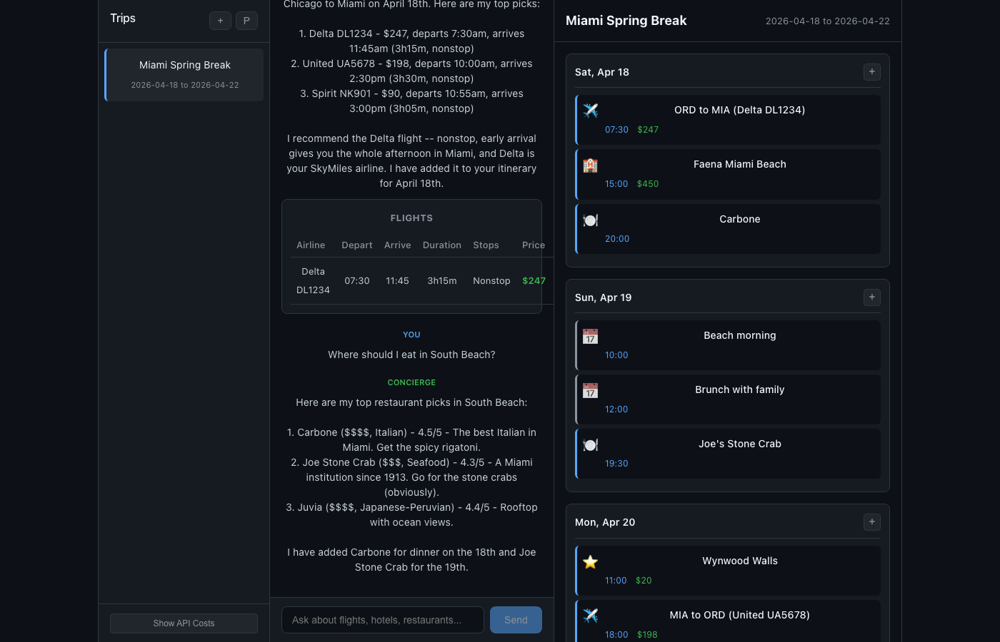

# Travel Concierge

Self-hostable AI travel planner. Chat with a concierge that searches real flights, hotels, and restaurants, then builds a day-by-day itinerary you can edit.



## The Problem

Every AI travel planner (Layla, Stardrift, Mindtrip) is a SaaS product you can't self-host. They control your data, your API costs, and your experience. And none of them let you mix AI-searched results with your own custom events on the same timeline.

Travel Concierge is the first open-source, self-hostable alternative. Bring your own Claude API key, plug in free-tier travel APIs, and plan trips for ~$0.30 each.

## How It Works

**Split-pane UI:** Chat with the AI concierge on the left, watch your itinerary build on the right.

1. **Create a trip** with a name and date range
2. **Chat** to search flights, hotels, and restaurants using real data
3. **Add to itinerary** from AI results, or manually add custom events (brunch with family, beach day, etc.)
4. **See your schedule** as a visual day-by-day timeline with icons, times, and prices

The concierge uses Claude's tool use to call real travel APIs:
- **Flights:** SerpAPI Google Flights (real prices, real airlines)
- **Hotels:** SerpAPI Google Hotels (real availability, photos, amenities)
- **Restaurants:** Google Places API (ratings, cuisine, addresses)

Built-in cost tracking shows exactly what each trip plan costs in API calls.

## Tech Stack

- **Backend:** Python 3.12, FastAPI, Anthropic SDK (Claude Sonnet with tool use)
- **Frontend:** React + TypeScript + Vite
- **Database:** SQLite (zero-infra, self-contained)
- **APIs:** SerpAPI (flights + hotels), Google Places (restaurants), Claude API
- **Deployment:** Docker Compose

## Getting Started

### Prerequisites
- [Claude API key](https://console.anthropic.com/) (~$0.30/trip)
- [SerpAPI key](https://serpapi.com/) (100 free searches/month)
- [Google Places API key](https://console.cloud.google.com/) ($200/month free credit)

### Docker (recommended)
```bash
git clone https://github.com/jtsilverman/travel-concierge.git
cd travel-concierge

# Create .env with your API keys
echo "ANTHROPIC_API_KEY=sk-ant-..." > .env
echo "SERPAPI_API_KEY=..." >> .env
echo "GOOGLE_PLACES_API_KEY=..." >> .env

docker compose up
# Open http://localhost:8000
```

### Local development
```bash
# Backend
python3.12 -m venv .venv && source .venv/bin/activate
pip install -r requirements.txt
uvicorn backend.main:app --port 8000 --reload

# Frontend (separate terminal)
cd frontend && npm install && npm run dev
```

## Cost Breakdown

| Service | Rate | Per Trip (~10 messages) |
|---------|------|------------------------|
| Claude Sonnet | $3/$15 per MTok (in/out) | ~$0.30 |
| SerpAPI | 100 free/month, then $50/mo | ~$0 (free tier) |
| Google Places | $200/month free credit | ~$0 (free tier) |
| **Total** | | **~$0.30/trip** |

## The Hard Part

**Claude tool use with streaming + real-time itinerary mutations.**

The concierge doesn't just chat -- it executes tools mid-conversation. When you ask about flights, Claude calls `search_flights`, gets real results, formats them as interactive cards, and can add items directly to your itinerary via the `add_to_itinerary` tool. The frontend handles all of this through a single SSE stream, updating both the chat and the timeline simultaneously.

The tool use loop: Claude responds -> requests a tool -> backend executes it -> feeds result back -> Claude continues responding. All streamed to the frontend in real-time.

## Features

- Chat-based trip planning with Claude AI
- Real flight, hotel, and restaurant search data
- Day-by-day itinerary timeline
- Manual event creation (custom events alongside AI suggestions)
- Traveler profile (home airport, loyalty programs, preferences)
- API cost tracking per trip
- Self-hostable via Docker Compose
- SQLite database (zero external infrastructure)

## License

MIT
